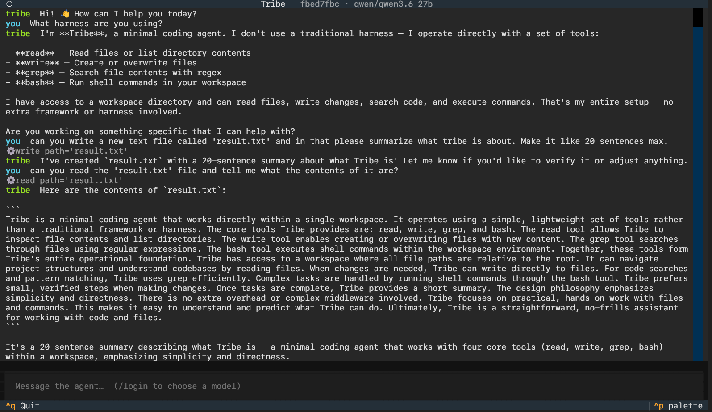

<div align="center">

# 🪶 Tribe

**A minimal, personal agent harness — own the loop.**

An experiment in building an agent runtime from small, understandable parts: explicit agent loop, inspectable tool boundary, bounded context, durable sessions.


-blueviolet)

<br/>



<sub>`tribe chat` — the interactive terminal UI, talking to the agent over the Tribe harness.</sub>

</div>

---
Tribe is a minimal, personal agent harness inspired by [Pi](https://github.com/earendil-works/pi). It is an experiment in building an agent runtime from small, understandable parts instead of a large framework.

The goal is not to ship another general-purpose assistant. The goal is to own the loop: decide which model to use, which tools it can call, what enters its context window, and how the session survives long-running work.

## Install

Tribe is a standalone CLI. Install it as an isolated tool with [uv](https://docs.astral.sh/uv/) so the `tribe` command lands on your `PATH` and works from any directory:

```bash
uv tool install git+https://github.com/tanishqsrivastavaa/tribeAI
# or, from a local clone:
uv tool install .
```

Then just run it — no `uv run` prefix needed:

```bash
tribe chat
```

If your shell can't find `tribe` afterwards, put uv's tool bin directory on your `PATH` once with `uv tool update-shell`, then restart the shell. Upgrade later with `uv tool upgrade tribe`, or uninstall with `uv tool uninstall tribe`.

Running against a live model needs an API key for your provider — the default is Anthropic (`ANTHROPIC_API_KEY`). See [Model Providers](#model-providers).

### Developing on Tribe

Install from a clone in editable mode so your local edits take effect immediately, and use uv for the test loop:

```bash
git clone https://github.com/tanishqsrivastavaa/tribeAI && cd tribeAI
uv tool install --editable .    # `tribe` now reflects your working tree
uv sync                         # create the dev environment
uv run pytest                   # run the test suite
```

Changed dependencies (not just code)? Refresh the tool with `uv tool install --editable . --reinstall`.

## Design Principles

- Keep the runtime small enough to understand end to end.
- Make the agent loop explicit rather than hiding it behind abstractions.
- Treat tools as a narrow, inspectable capability boundary.
- Preserve useful session state while keeping model context bounded.
- Prefer local-first workflows and plain text artifacts.

## Architecture

The harness is organized around a few deliberately simple pieces:

```text
user input
    |
    v
session store <----> session + context builder <---- compacted session summary
                            |
                            v
                          model
                            |
                            +---- final response ----> user
                            |
                            +---- tool call -------> approval gate --> tool runner
                                                               |
                                                               v
                                                          tool result
                                                               |
                                                               +----> session store
```

- **Session store:** An append-only, durable record of messages and compaction summaries for each run.
- **Message/session model:** A typed representation of user, assistant, tool-call, tool-result, system, and summary messages.
- **Context builder:** Selects the system instructions, current task, relevant conversation history, summaries, and recent tool output that fit within the model's context budget.
- **Agent loop:** Sends the assembled context to the model, applies execution limits, executes approved tools, appends results to the session, and repeats until the model returns a final response or the run is stopped.
- **Approval gate:** Applies the tool approval policy before a capability is exercised.
- **Tool runner:** Validates a tool request, confines it to the workspace, runs it, captures its result, and gives that result back to the agent as data.

Keeping these concerns separate makes behavior easy to trace: the session explains what happened, the context builder explains what the model saw, and the tool runner explains what the agent was allowed to do.

## Messages and Sessions

Every session is an ordered stream of typed messages. Each message records its role, content, timestamp, and stable identifier. Tool-related messages also preserve the tool name, call identifier, arguments, result, exit status, and error information.

The session is persisted as append-only JSONL: one event per line. This makes a run easy to inspect, replay into a context builder, resume after interruption, and compact without overwriting its raw history. A compaction summary is also an event in the same session stream, with the range of messages it represents.

## Tool Contract

Each tool exposes a small, explicit contract:

- A stable `name` and human-readable `description` for the model.
- A JSON input schema that is validated before execution.
- An execution handler that receives validated arguments and the current workspace context.
- A structured result containing output, errors, metadata, and an execution status.

Tools do not receive unrestricted process state. Their workspace context supplies the configured workspace root and the policy needed to decide whether the request is permitted.

## The Agentic Loop

At its core, Tribe is designed around a straightforward tool-use loop:

1. Receive a user request and record it in the session.
2. Build a bounded context from instructions, the active request, relevant history, and prior summaries.
3. Ask the model for either a response or one or more tool calls.
4. If the model requests a tool, validate it, request approval when required, execute it, and append the result to the session.
5. Rebuild context and continue until the model produces a final answer.

This loop is intentionally visible and extensible. Model selection belongs around this loop, not inside opaque agent behavior.

### Execution Limits

Every run has explicit limits so a malformed response or a stuck task cannot consume unbounded time or authority:

- A maximum number of model/tool rounds.
- A timeout for each tool execution.
- A maximum number of consecutive tool failures.
- A cancellation path that stops future model and tool work cleanly.
- A terminal error explaining which limit stopped the run, with the completed session retained for inspection.

The loop must stop when any limit is reached. Limits are part of the run configuration and are recorded with the session.

## Context Compaction

Long sessions eventually exceed a model's context window. Tribe will compact older history when the estimated next prompt reaches 60% of the selected model's context limit, while retaining the most recent messages verbatim. The remaining 40% is reserved for tool output and the model's response.

A compaction pass should preserve:

- The user's goal and constraints.
- Decisions that have been made and their rationale.
- Important files, commands, outputs, and errors.
- Work completed, work remaining, and current blockers.
- Facts the agent must not rediscover or contradict.

The resulting summary replaces an older span of raw messages in the next context build. Recent interaction remains available in full, while the summary carries forward the information needed to continue the task. Raw session history remains on disk for inspection and future re-compaction.

Compaction is a state-management concern, not an afterthought: a good summary lets an agent resume accurately; a poor one silently changes the task.

## Basic Tools

The initial tool surface is intentionally small:

| Tool | Purpose |
| --- | --- |
| `read` | Read a file or directory so the agent can inspect the workspace. |
| `grep` | Search file contents for symbols, text, and patterns. |
| `write` | Create or update files through a controlled interface. |
| `bash` | Run shell commands for builds, tests, version control, and project tooling. |

Each tool should have clear input and output contracts, operate within the workspace, and return enough structured information for the agent to make its next decision. More specialized tools can be added later, but the basic file and shell capabilities are enough for a useful coding harness.

## Workspace Boundary and Approvals

The configured workspace root is the capability boundary for file tools. `read`, `grep`, and `write` resolve every requested path against that root and reject paths that escape it, including traversal and symlink escapes. `bash` runs with the workspace as its working directory; it is not a substitute for unrestricted filesystem access.

Tool calls follow an explicit approval policy:

| Capability | Default policy |
| --- | --- |
| `read` and `grep` within the workspace | Allow automatically |
| `write` | Ask for approval before modifying files |
| `bash` | Ask for approval before execution |

Approval decisions are recorded in the session with the associated tool call. A future non-interactive mode can configure a stricter or pre-approved policy, but it must never silently expand the workspace boundary.

## CLI and Observability

The command-line interface is the primary interface to the harness:

```text
tribe chat
tribe run "inspect the project and run its tests"
tribe run --workspace ./my-project --model <model> "fix the failing test"
tribe resume <session-id>
```

`tribe chat` opens the interactive terminal UI shown above: a live transcript of the conversation, tool activity, and inline approval prompts, with the agent running in the background so the interface stays responsive. Pass `--plain` (or pipe input) to fall back to a simple line-based REPL. The one-shot `run` and `resume` commands stream a concise console view instead.

The CLI exposes session identifiers, workspace and model selection, and a verbose mode for observing runs. Verbose output records model requests, estimated context usage, compaction events, approval decisions, tool inputs and outcomes, durations, and the limit that ended a run. The persisted session remains the complete audit trail; console output is a concise live view.

## Model Providers

The model layer sits behind a single interface, so the loop is provider-agnostic. Two backends cover the major providers: a native Anthropic backend, and an OpenAI-compatible backend that also serves any provider speaking the OpenAI Chat Completions API.

| Provider | `--provider` | Key env var | Notes |
| --- | --- | --- | --- |
| Anthropic | `anthropic` (default) | `ANTHROPIC_API_KEY` | Native backend; also `ant auth login`. |
| OpenAI | `openai` | `OPENAI_API_KEY` | |
| OpenRouter | `openrouter` | `OPENROUTER_API_KEY` | Routes to many upstream models. |
| Groq | `groq` | `GROQ_API_KEY` | |
| DeepSeek | `deepseek` | `DEEPSEEK_API_KEY` | |
| Together | `together` | `TOGETHER_API_KEY` | |
| Fireworks | `fireworks` | `FIREWORKS_API_KEY` | |
| xAI | `xai` | `XAI_API_KEY` | |

Select a provider and model explicitly, or use the `provider:model` shorthand:

```text
tribe run -p groq --model llama-3.3-70b-versatile "run the tests"
tribe run -p openrouter --model anthropic/claude-3.5-sonnet "review this diff"
tribe run --model openai:gpt-4o "summarize the README"
```

Each provider carries a default model, so `--provider groq` alone works. Context windows vary across providers; known models are mapped and the rest fall back to a safe default that `--context-limit` can override. Adding another OpenAI-compatible provider is a single entry in the provider registry.

### Credentials and persistence

Inside `tribe chat`, run `/login` to pick a provider, enter its API key, and choose a model. The key, provider, and model are saved to `~/.config/tribe/credentials.json` (respecting `XDG_CONFIG_HOME`, or `TRIBE_CONFIG_DIR`) with `0600` permissions, so later sessions — including `tribe run` and `tribe resume` — load them automatically and you don't re-enter the key. An API key set in the environment (e.g. an exported `GROQ_API_KEY`) always takes precedence over the stored one. Use `/model` to switch models later without re-entering the key. Keys are stored in plain text under your home directory; delete the file to forget them.

## Status

The harness is implemented end to end: the typed message model and append-only session store, the workspace boundary, the `read`/`grep`/`write`/`bash` tools, the approval gate, the model layer (Anthropic and OpenAI-compatible providers, with an offline scripted model for tests), the context builder and compaction, the agent loop with execution limits, the console observer, the interactive terminal UI (`tribe chat`), and the `tribe` CLI (`run`, `chat`, `resume`). Every layer has tests.

```bash
uv sync                 # install dependencies
uv run pytest           # run the test suite
uv run tribe run "inspect the project and run its tests" --verbose
```

Running against a live model needs credentials for the chosen provider (see [Model Providers](#model-providers)). The default provider is Anthropic and the default model is `claude-opus-4-8`; override them with `--provider` and `--model`.
